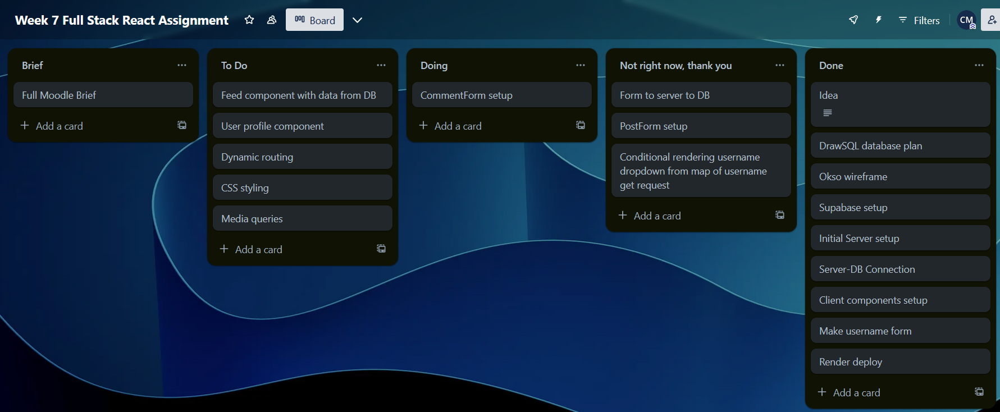

# week7-assignment

## reflection

I've had a bit of a nightmare with this assignment and it isn't even finished yet. I've done parts of most of the requirements for the assignment:

- I've got a react client with the right components but currently most of them are full of placeholders without the correct functionality
- I've made an express server with some GET and POST endpoints connected to my database
- I've made multiple react forms for users to create an account (this one works), create posts (this one is the **major** problem), and comment on other posts (this one can't really work until the posts one works)
- I've created multiple pages using react router with natural links between them, but haven't done any dynamic routing as that was planned for the user profiles which I haven't done yet
- I've designed my database schema and seeded the database with some example data (2 users, 1 post, 4 comments)
- I haven't yet used SQL to retrieve posts and comments
- I've used map, but so far only to generate options in a select input in my PostForm

As you can probably tell, I've encountered several problems while working on this. The first issue was more of a worry that I realised when making my wireframe as the way I planned to implement usernames (the only way I could think of was by including it as another input in the PostForm like in the week 4 assignment) would have left each username paired up to multiple ids. The next problem came when setting up my database and using test SELECT queries as I was unsure at first how to use JOIN on three tables, but the solution turned out to be pretty easy.

### The main issue

My next issue came when making my PostForm as I was unsure how I could send the inputs of my PostForm to two tables at once, as the username had to go to the users table while the rest would go to the posts table but would have to include the user_id from the username that had just been submitted. Manny suggested having 3 separate fetches from the post form to submit the username, fetch the id matching that username, and then add that id to the formValues object to be submitted. He also suggested a stretch goal of having a dropdown to allow users to select from usernames that had already been created. I tried really hard to get this working because it would've removed the aforementioned issue of username and id not always matching up, but I probably ended up derailing the rest of the project by focusing on it too much and not giving up when it clearly wasn't working.

The first problem I ran into was the whole app suddenly not rendering after I had fetched from the /userquery endpoint to create an array of usernames that I could map through to create a new option in the dropdown input for each. I had this same issue in week 6 and it had been because I had fetched into a .js file in my lib folder then tried importing the result into a component, and used the same solution this time of bringing the fetch function into the component itself to avoid importing the function or the result. This fixed the problem, but I still had some syntax errors that took a while to fix but weren't too hard.

The next problem was more subtle but ruined the planned functionality of the form. I added a console.log to the submit handler function for the PostForm so I could check the submitted data, but I noticed that the user_id field was always an empty string instead of the id that matched the username in the selected dropdown option. I guessed that this was probably a fetch issue because the dropdown was always empty for a while after loading the page so I presumed that there was some difference between rendering the names of the options (which appeared eventually) and the values of the options (which didn't appear at all). I did some googling about conditional rendering not awaiting the result of a fetch, but the solution I found was to use useState and useEffect which I was already using because I had scrapped my initial function and reworked the one I used last week that used useEffect and worked successfully. I next looked at using async and await with an array.map and borrowed some syntax from a stackoverflow thread though I didn't fully understand it so this could have been an actual working solution that I overlooked. I ended up getting an error from trying that method (the error said &quot;Warning: Functions are not valid as a React child. This may happen if you return a Component instead of <Component /> from render&quot;) so I did some more googling and found some solutions that I couldn't make sense of.

I then called it a day for Saturday as I've usually been able to come back on Sunday morning and fix Saturday's code with a new solution I've thought of (or at least a better description of the problem that I can google to find a solution), but instead I had a bit of a meltdown on Sunday and couldn't get very much done. The only thing I did spot was that I'd completely forgotten to include onChange in the select input, and I was convinced that this would solve all of my problems and let me move on to the rest of the app but surprisingly it didn't. I went back and tried the previous solutions again with the onChange included, but this didn't work either. I did some more googling about the change event listener and onChange working with a select input, but all I could find was that they should work together fine. Basically I still don't know why it isn't working, and I've wasted a lot of time stressing about it instead of working on the rest of my code.

The two solutions I've been able to think of now after calming down a bit are:

- Use Manny's suggestion of having 3 separate fetches from the post form to submit the username, fetch the id matching that username, and then add that id to the formValues object to be submitted
- Stick with the dropdown/select option but remove the UserForm and instead have an array of pre-made usernames that can be mapped through to render the dropdown options like I was doing but without needing a fetch (in hindsight, I should have done this hours ago if I had thought of it so that I could test if it really was an async/await issue)

I think what I should do next is to delete all the database tables and remake them with a more limited version that ditches the users table and user_id to just have username as part of the PostForm (like in week 4) then have the JOIN be between posts and comments with a 1:many relationship. I could still implement dynamic routing this way if I make it so that the feed only shows posts without comments, and the user needs to click on the post to view comments.

Overall, it hasn't gone well but I hope I'll earn at least half a mark with a nice detailed reflection.

## sources

- Joining more than two tables in SQL query - https://learnsql.com/blog/how-to-join-3-tables-or-more-in-sql/
- Conditional rendering not awaiting fetch (the proposed solution was using useState and useEffect which I'm already doing) - https://stackoverflow.com/questions/71056143/conditional-rendering-not-waiting-for-fetch-to-complete
- Using async await with array.map (as a possible solution to the conditional rendering and fetch issue) - https://stackoverflow.com/questions/40140149/use-async-await-with-array-map
- Function not valid as a react child (trying to fix an error I was getting after trying the previous method) - https://stackoverflow.com/questions/51626011/why-am-i-getting-warning-functions-are-not-valid-as-a-react-child
- Getting onChange to work with a dropdown - https://stackoverflow.com/questions/5024056/how-to-pass-parameters-on-onchange-of-html-select

## screenshots

Wireframe: 
Database schema in DrawSQL: 
Trello: 
